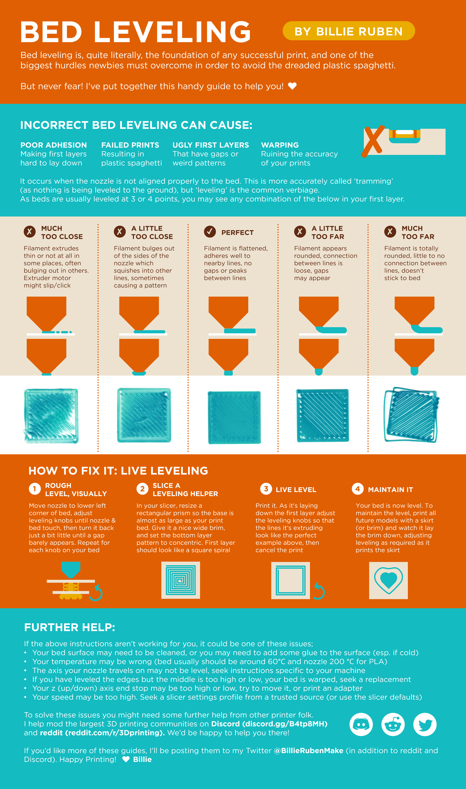

[[ender3v3se-changelog|Printer Changelog]]

# Slicer Configuration
	
* I've been using [Ultimaker Cura](https://ultimaker.com/software/ultimaker-cura/) as the slicer for this printer, though I've edited the start and end gcode to be `start_print BED_TEMP={material_bed_temperature_layer_0} EXTRUDER_TEMP={material_print_temperature_layer_0}` and `end_print` respectively so that Klipper can handle the start and end automation alongside having changed the bed to the full 230x230mm size.
* I also use [OctoPrint Connection](https://marketplace.ultimaker.com/app/cura/plugins/fieldofview/OctoPrintPlugin) for Cura so that it can hook up to the pretend OctoPrint API running on Moonraker.
	* To generate an API key for the plugin, go to the Fluidd authentication settings and hit API key.

# Equipment

* [Replacement extruder silicone socks](https://www.amazon.ca/gp/product/B0CJTZTZ9S)
  * This should not necessarily need replacing unless it breaks.
* [High speed 0.4mm and 0.6mm nozzles](https://www.amazon.ca/gp/product/B0B5N1C8FB)
  * Please change your slicer settings if you switch to a 0.6mm nozzle.
  * [Creality Nozzle Replacement Video](https://www.youtube.com/watch?v=xTZfIqY6NMY)
* [Dual-sided printing platform, glossy PET and coated PEI](https://www.amazon.ca/gp/product/B0CQNVKWYZ)
  * The PET sticker surface is the patterned surface, which tolerates up to 80C and is good for PLA, PETG and TPU.
  * The coated PEI is the frosted surface and can be used for PLA, PETG, ABS, TPU, ASA, PET, PA, PC, ...

# Failed Upgrades

## LED Strip

[Product Page](https://www.amazon.ca/gp/product/B0CM3KT9CY)

Current status:
* An attempt at performing the install occurred on 2024-08-02.
* The aluminium frame binding against the plastic caused the wires for the power to short 24V to ground and be broken in the process.
* The wires that hook up to the power supply need to be replaced in some fashion.

## Filament Runout Sensor

[Product Page](https://www.amazon.ca/gp/product/B0CP5ZFCGN)

Current status:
* An attempt at performing the install occurred on 2024-08-02.
* The aluminium frame binding against the plastic caused the wires for power and data to be broken in the process.

# Future Upgrades

Threads:
* https://www.reddit.com/r/Ender3V3SE/comments/1avet55/upgrades_to_the_ender3_v3_se
			
## Y-axis Linear Rails

[Printables](https://www.printables.com/model/694446-ender-3-v3-se-ke-d3d-y-rails)
[GitHub](https://github.com/DerrickDarrell/Creality-Ender-3-V3-SE-KE/tree/main/SE%2BKE%20Y%20Rails%20Conversion)

Materials:
* MGN12H rails (300mm length)
* M3x3x5mm heat inserts
* x2 - M3x14mm screws (front mount - stepper)
* x2 - M3x20mm screws (front mount - stepper)
* x16 - M3x8mm SHCS screws (Linear Rails)
* x4 - M4x20mm screws (rear mount - ONLY USE 20MM SCREWS)
* X8 - M3x6mm BHCS screws (rail carriage)
* x6 - M3x8mm BHCS screws (bed frame)
* x2 - M3x10mm screws (bed frame)

## X-axis Linear Rails

[Printables](https://www.printables.com/model/716958-linear-x-rail-mod-ender-3-v3-se)

Materials:
* 1xMGN9C 300mm Linear Rail (Make sure to click on the correct item before purchasing) - [https://www.aliexpress.com/item/1005002516956172.html?](https://www.aliexpress.com/item/1005002516956172.html?)
* 2xMGN9 Alignment tool - [https://www.thingiverse.com/thing:3533580](https://www.thingiverse.com/thing:3533580)
* 3xM5-0.8x10mm Flat Round Head Screws - [https://amzn.eu/d/g4peaSg](https://amzn.eu/d/g4peaSg)
* 7xM3 drop in T nut - [https://www.aliexpress.com/item/1005005751429865.html?](https://www.aliexpress.com/item/1005005751429865.html?)
* 11xM3x12mm Screws
* 4xM3 washers

## Some form of parts fan and extruder fan upgrades

Probably dual 5015 and a 4020?

## ABS + ASA Printing Capacity

* Enclosure
* All-metal hot end with ceramic heating kit

## Gantry Support

[Printables](https://www.printables.com/cs/model/730007-ender-3-v3-se-ke-gantry-support)

Materials:
* M4 bolts and nuts
* 1 meter of M10 threaded shaft divided in two

# Calibration

## Bed Levelling

The tune section of the Fluidd interface is relevant for generating a bed mesh. It uses the CR Touch probe attached to the printer to figure out the discrepancies in bed flatness.

## Z-offset

The ideal distance from the nozzle to the bed is 0.15mm. This is the value you mostly need for this printer. The probe generally takes care of the rest now and has a static offset from the nozzle itself.